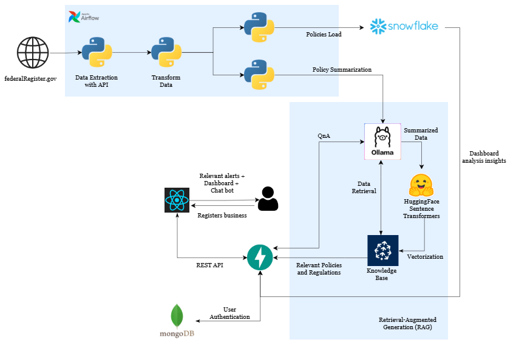

# PoliSights.ai

## Live application link

[](http://homelab.chaudharyanshul.com:3000)

[](https://prezi.com/view/oG3DDvXz27aquEKrEfld)

## Technologies Used
[](https://react.dev/)
[](https://fastapi.tiangolo.com/)
[](https://github.com/)
[](https://www.python.org/)
[](https://pandas.pydata.org/)
[](https://numpy.org/)
[](https://openai.com/)
[](https://www.snowflake.com/)
[](https://huggingface.co/docs/transformers/en/model_doc/bert)
[](https://www.docker.com/)
[](https://airflow.apache.org/)
[](https://www.selenium.dev/)
[](https://plotly.com/)
[](https://www.mongodb.com/)
[](https://www.pinecone.io/)

## Overview

PoliSights.ai is an AI-powered platform that helps small businesses stay informed about federal policy changes in real time. The system extracts policies from the Federal Register, processes them using AI, and delivers personalized recommendations and alerts to businesses based on their profile.

## Problem Statement

### Challenge:
Small businesses struggle to stay informed about frequent regulatory changes that impact their operations. The Federal Register publishes numerous policy updates daily, but businesses lack an efficient way to:

- Track relevant policies specific to their industry.
- Understand the impact of new regulations.
- Stay compliant without investing in expensive legal services.
- Receive timely alerts before policies affect their business.</br>

Manually searching and interpreting policies is time-consuming, inefficient, and costly, putting small businesses at a disadvantage compared to large corporations with dedicated compliance teams.

### Solution:
The objective of PoliSights.ai is to empower small businesses by providing an AI-driven policy tracking system that ensures they stay informed about relevant regulatory changes in real time. By leveraging web scraping, NLP, and vector search, the system automatically extracts policies from the Federal Register, matches them to businesses based on industry and profile, and delivers personalized alerts. A user-friendly dashboard allows businesses to search, analyze, and track policy trends, helping them make informed decisions and maintain compliance efficiently.

## Architecture:


## Data Sources
- [Food and Consumer Service](https://www.federalregister.gov/agencies/food-and-consumer-service)
- [Food and Nutrition Service](https://www.federalregister.gov/agencies/food-and-nutrition-service)
- [Food Safety and Inspection Service](https://www.federalregister.gov/agencies/food-safety-and-inspection-service)
- [National Institute of Food and Agriculture](https://www.federalregister.gov/agencies/national-institute-of-food-and-agriculture)

## Key Features
- Real-Time Policy Alerts – Businesses receive notifications on relevant policy changes.</br>
- AI-Powered Search & Recommendations – Policies are matched using Vector Search & NLP.</br>
- User-Friendly Dashboard – Businesses can track policy trends, search updates, and assess compliance risks.</br>
- Industry Insights & Compliance Risk Analysis – Helps businesses understand the impact of policies.</br>


## Project Tree

```
📦 
├─ .gitignore
├─ README.md
├─ airflow-pipeline
│  ├─ .env.example
│  ├─ .gitignore
│  ├─ .gitkeeper
│  ├─ Dockerfile
│  ├─ dags
│  │  ├─ configuration.properties.example
│  │  ├─ fr_dag.py
│  │  └─ fr_helper
│  │     ├─ api_call.py
│  │     ├─ load_pdf.py
│  │     ├─ load_snowflake.py
│  │     └─ scrape_ids.py
│  ├─ docker-compose.yaml
│  └─ requirements.txt
├─ backend
│  ├─ .gitignore
│  ├─ Dockerfile
│  ├─ configs
│  │  ├─ __init__.py
│  │  ├─ cloudinary_config.py
│  │  ├─ mongo_configs.py
│  │  ├─ ollama_config.py
│  │  └─ snowflake_config.py
│  ├─ configuration.properties.example
│  ├─ main.py
│  ├─ models
│  │  ├─ LoginRequest.py
│  │  ├─ PDFRequest.py
│  │  ├─ Post.py
│  │  ├─ User.py
│  │  └─ UserDoc.py
│  ├─ requirements.txt
│  ├─ routes
│  │  ├─ __init__.py
│  │  ├─ authRouter.py
│  │  ├─ chatRouter.py
│  │  ├─ communityRouter.py
│  │  ├─ healthRouter.py
│  │  ├─ pdfRouter.py
│  │  ├─ userDocRouter.py
│  │  ├─ userRouter.py
│  │  └─ visualizeRouter.py
│  ├─ services
│  │  └─ pdf_string.py
│  └─ test_connection.py
├─ civic-sentinel
│  ├─ .gitignore
│  ├─ .vite
│  │  └─ deps
│  │     ├─ _metadata.json
│  │     └─ package.json
│  ├─ README.md
│  ├─ components.json
│  ├─ eslint.config.js
│  ├─ index.html
│  ├─ package-lock.json
│  ├─ package.json
│  ├─ postcss.config.js
│  ├─ public
│  │  └─ placeholder.svg
│  ├─ src
│  │  ├─ App.css
│  │  ├─ App.tsx
│  │  ├─ assets
│  │  │  ├─ Business solution.gif
│  │  │  ├─ aaryan.jpeg
│  │  │  ├─ anshul.jpeg
│  │  │  ├─ kartik.jpeg
│  │  │  ├─ kartikey.jpeg
│  │  │  ├─ logo.svg
│  │  │  └─ muskan.jpeg
│  │  ├─ components
│  │  │  ├─ AuthCard.tsx
│  │  │  ├─ Footer.tsx
│  │  │  ├─ Navbar.tsx
│  │  │  ├─ NewDiscussionModal.tsx
│  │  │  ├─ auth
│  │  │  │  ├─ LoginForm.tsx
│  │  │  │  └─ RegisterForm.tsx
│  │  │  ├─ layout
│  │  │  │  └─ DashboardLayout.tsx
│  │  │  ├─ sidebar
│  │  │  │  └─ MainSidebar.tsx
│  │  │  ├─ theme-provider.tsx
│  │  │  └─ ui
│  │  │     ├─ accordion.tsx
│  │  │     ├─ alert-dialog.tsx
│  │  │     ├─ alert.tsx
│  │  │     ├─ aspect-ratio.tsx
│  │  │     ├─ avatar.tsx
│  │  │     ├─ badge.tsx
│  │  │     ├─ breadcrumb.tsx
│  │  │     ├─ button.tsx
│  │  │     ├─ calendar.tsx
│  │  │     ├─ card.tsx
│  │  │     ├─ carousel.tsx
│  │  │     ├─ chart.tsx
│  │  │     ├─ checkbox.tsx
│  │  │     ├─ collapsible.tsx
│  │  │     ├─ command.tsx
│  │  │     ├─ context-menu.tsx
│  │  │     ├─ dialog.tsx
│  │  │     ├─ drawer.tsx
│  │  │     ├─ dropdown-menu.tsx
│  │  │     ├─ form.tsx
│  │  │     ├─ hover-card.tsx
│  │  │     ├─ input-otp.tsx
│  │  │     ├─ input.tsx
│  │  │     ├─ label.tsx
│  │  │     ├─ menubar.tsx
│  │  │     ├─ navigation-menu.tsx
│  │  │     ├─ pagination.tsx
│  │  │     ├─ popover.tsx
│  │  │     ├─ progress.tsx
│  │  │     ├─ radio-group.tsx
│  │  │     ├─ resizable.tsx
│  │  │     ├─ scroll-area.tsx
│  │  │     ├─ select.tsx
│  │  │     ├─ separator.tsx
│  │  │     ├─ sheet.tsx
│  │  │     ├─ sidebar.tsx
│  │  │     ├─ skeleton.tsx
│  │  │     ├─ slider.tsx
│  │  │     ├─ sonner.tsx
│  │  │     ├─ switch.tsx
│  │  │     ├─ table.tsx
│  │  │     ├─ tabs.tsx
│  │  │     ├─ textarea.tsx
│  │  │     ├─ toast.tsx
│  │  │     ├─ toaster.tsx
│  │  │     ├─ toggle-group.tsx
│  │  │     ├─ toggle.tsx
│  │  │     ├─ tooltip.tsx
│  │  │     └─ use-toast.ts
│  │  ├─ hooks
│  │  │  ├─ use-mobile.tsx
│  │  │  └─ use-toast.ts
│  │  ├─ index.css
│  │  ├─ lib
│  │  │  └─ utils.ts
│  │  ├─ main.tsx
│  │  ├─ pages
│  │  │  ├─ AboutPage.tsx
│  │  │  ├─ ChatInterface.css
│  │  │  ├─ ChatInterface.tsx
│  │  │  ├─ Community.tsx
│  │  │  ├─ Dashboard.tsx
│  │  │  ├─ DiscussionDetails.tsx
│  │  │  ├─ HomePage.css
│  │  │  ├─ Homepage.tsx
│  │  │  ├─ Index.tsx
│  │  │  ├─ Insights.tsx
│  │  │  ├─ NotFound.tsx
│  │  │  ├─ NotificationsPage.tsx
│  │  │  ├─ PricingPage.tsx
│  │  │  └─ ProfilePage.tsx
│  │  ├─ services
│  │  │  ├─ ChatService.ts
│  │  │  ├─ CommunityServices.ts
│  │  │  ├─ NotificationService.ts
│  │  │  ├─ VisualizeService.ts
│  │  │  ├─ authService.ts
│  │  │  ├─ axios.ts
│  │  │  └─ userDocServices.ts
│  │  └─ vite-env.d.ts
│  ├─ tailwind.config.ts
│  ├─ tsconfig.app.json
│  ├─ tsconfig.json
│  ├─ tsconfig.node.json
│  └─ vite.config.ts
├─ configuration.properties.example
├─ package-lock.json
├─ package.json
├─ requirements.txt
└─ scripts
   ├─ page_content.html
   ├─ page_debug.png
   ├─ rule.py
   ├─ snowflake_load.ipynb
   ├─ snowflake_setup_script.sql
   ├─ test.ipynb
   ├─ test_ollama.py
   └─ vectorize.ipynb
```
©generated by [Project Tree Generator](https://woochanleee.github.io/project-tree-generator)
©generated by [Project Tree Generator](https://woochanleee.github.io/project-tree-generator)

## Prerequisites
Before running this project, ensure you have the following prerequisites set up:

- **Python**: Ensure Python is installed on your system.
- **Docker**: Ensure Docker-desktop is installed on your system.
- **Virtual Environment**: Set up a virtual environment to manage dependencies and isolate your project's environment from other Python projects. You can create a virtual environment using `virtualenv` or `venv`.
- **requirements.txt**: Install the required Python dependencies by running the command:
  ```
  pip install -r requirements.txt
  ```
- **Config File**: Set up the `configurations.properties` file with the necessary credentials and configurations.

- **Snowflake**: Use `scripts/snowflake_setup_script.sql` to define the queries on snowflake. Also, ensure you have the necessary credentials and configurations set up in the `configurations.properties` file for connecting to Snowflake.

## How to Run the Application Locally

To run the application locally, follow these steps:

1. Clone the repository to get all the source code on your machine.

2. Use `source/venv/bin/activate` to activate the environment.

3. Create a configuration.properties file in the all the directories where configuration.properties.example is present. Sample config file:

```
[mongodb]
MONGODB_URL = appName=civic_ai_auth/CivicAI
DATABASE_NAME = 
COLLECTION_NAME = 
COLLECTION_NAME_NOTI = 
 
[auth-api]
SECRET_KEY = 
ALGORITHM = 
ACCESS_TOKEN_EXPIRE_MINUTES = 
 
[userDoc]
COLLECTION_NAME = 
 
[password]
schemes = 
deprecated = 
tokenUrl = 
 
[cloudinary]
CLOUD_NAME = 
API_KEY = 
API_SECRET = 
 
[cors]
ALLOW_ORIGINS = 
 
[SNOWFLAKE]
user = 
password = 
account = 
warehouse = 
database = 
schema = 
role = 
table = 
stage = 
file_format = 

[community]
COLLECTION_NAME = 
```

4. Once you have set up your environment variables, Use `docker-compose up - build` to run the application

5. Access the Airflow UI by navigating to http://localhost:8080/ in your web browser.

6. Once the DAGs have run successfully, view the React application

7. Enter username and password if you've already logged in. Otherwise you can register yourself and then run the application.

## Team Information

Name  | Email |
------|-------|
Aaryan Praveen  | praveen.aa@northeastern.edu |
Anshul Chaudhary  | chaudhary.ans@northeastern.edu |
Kartikey Vijayakumar Hebbar | vijayakumarhebbar.k@northeastern.edu |
Kartik Shanbhag | shanbhag.k@northeastern.edu |
Muskan Raisinghani  | raisinghani.m@northeastern.edu |
